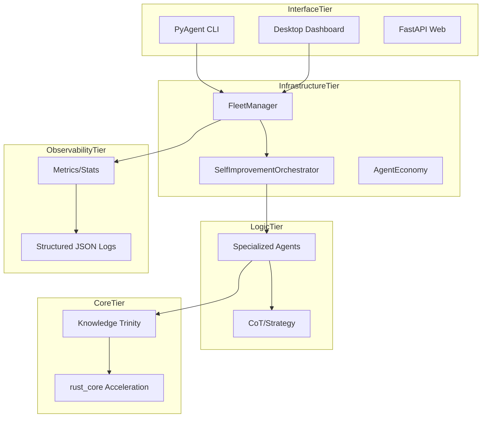

# Swarm Social Topology (v3.6.0)

```mermaid
graph TD
    subgraph InterfaceTier
        CLI[PyAgent CLI]
        GUI[Desktop Dashboard]
        API[FastAPI Web]
    end

    subgraph InfrastructureTier
        Fleet[FleetManager]
        Orch[SelfImprovementOrchestrator]
        Economy[AgentEconomy]
    end

    subgraph LogicTier
        Agents[Specialized Agents]
        Reasoning[CoT/Strategy]
    end

    subgraph CoreTier
        Trinity[Knowledge Trinity]
        Rust[rust_core Acceleration]
    end

    subgraph ObservabilityTier
        Stats[Metrics/Stats]
        Logs[Structured JSON Logs]
    end

    CLI --> Fleet
    GUI --> Fleet
    Fleet --> Orch
    Orch --> Agents
    Agents --> Trinity
    Agents --> Reasoning
    Trinity --> Rust
    Fleet --> Stats
    Stats --> Logs
```
