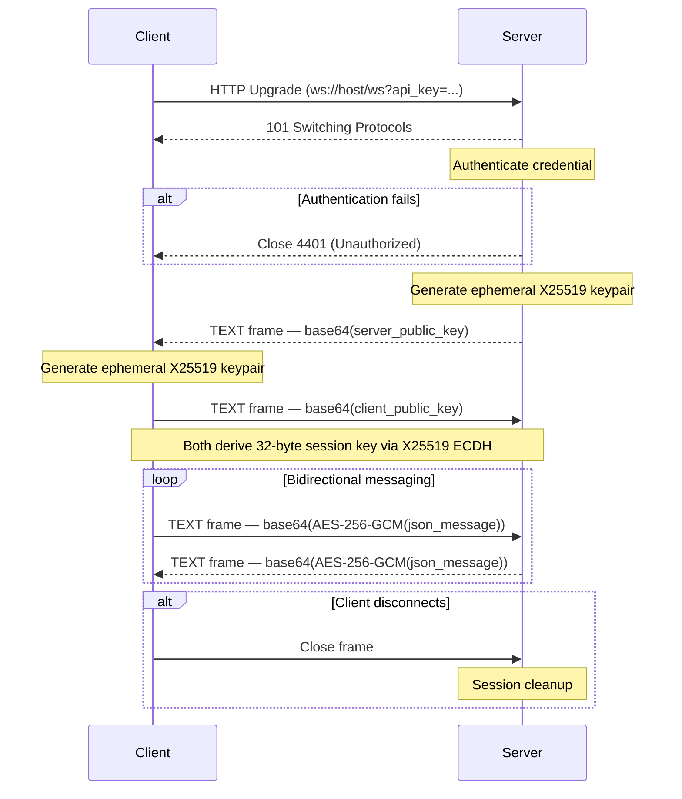

# WebSocket

The PyAgent backend provides a single end-to-end encrypted WebSocket endpoint.
All message payloads are protected with **X25519 ECDH key exchange + AES-256-GCM**.

---

## Endpoint

```
ws://host:8000/ws         (dev)
wss://host/ws             (production behind TLS terminator)
```

---

## Connection & Authentication

Pass credentials as query parameters (HTTP headers cannot be set post-upgrade):

```
ws://localhost:8000/ws?api_key=your-api-key
ws://localhost:8000/ws?token=eyJhbGci...
```

If authentication fails the server closes immediately with **close code 4401**.

---

## Handshake Protocol



---

## Step-by-Step

| Step | Direction | Frame type | Content |
|---|---|---|---|
| 1 | Client → Server | HTTP | Upgrade request + auth query param |
| 2 | Server → Client | HTTP | 101 Switching Protocols |
| 3 | _(auth check)_ | — | Server verifies credential; closes 4401 on failure |
| 4 | Server → Client | TEXT | `base64(server_ephemeral_x25519_public_key)` |
| 5 | Client → Server | TEXT | `base64(client_ephemeral_x25519_public_key)` |
| 6 | _(key derivation)_ | — | Both sides compute a 32-byte AES-256-GCM session key |
| 7+ | Bidirectional | TEXT | `base64(AES-256-GCM(json_payload))` |

---

## Message Format

After the handshake every frame is a base64-encoded AES-256-GCM ciphertext. When decrypted
the plaintext is a UTF-8 JSON object. Outbound messages from the client follow this shape:

```json
{
  "type": "task",
  "payload": {
    "task": "Analyse the Rust core benchmark results",
    "agent": "2think"
  }
}
```

The server may send back streamed chunks, status events, or errors — all in the same
encrypted JSON format. Specific message types are defined by `backend/ws_handler.py`.

---

## Close Codes

| Close Code | Meaning |
|---|---|
| `4401` | Authentication failure (invalid or missing credential) |
| `1011` | Internal server error (e.g., decryption failure after handshake) |
| `1000` | Normal closure |

---

## Client Implementation Tips

1. Exchange public keys **before** sending any application messages.
2. Use a standard X25519 library (e.g., `cryptography` for Python, `tweetnacl` for JS).
3. Derive the session key with raw X25519 scalar multiplication — the result is the 32-byte
   AES-256-GCM key directly (no KDF step).
4. For each encrypted frame use a random 12-byte nonce; prepend it to the ciphertext before
   base64-encoding if the server expects `nonce + ciphertext` combined format.
5. Reconnect logic should re-run the full handshake (steps 4–6) on each new connection.
