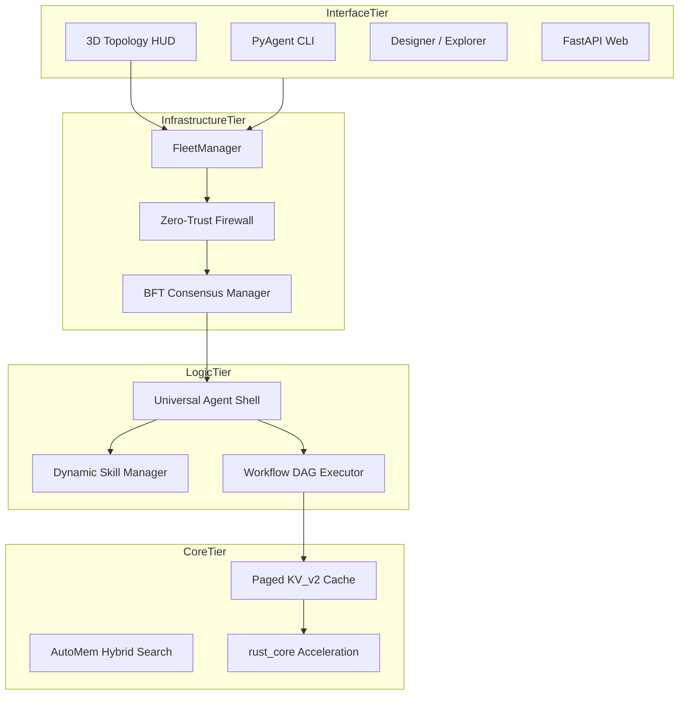

# Swarm Singularity Topology (v4.0.0)

```mermaid
graph TD
    subgraph InterfaceTier
        CLI[PyAgent CLI]
        HUD[3D Topology HUD]
        DEP[Designer / Explorer]
        API[FastAPI Web]
    end

    subgraph InfrastructureTier
        Fleet[FleetManager]
        Firewall[Zero-Trust Firewall]
        Consensus[BFT Consensus Manager]
    end

    subgraph LogicTier
        Shell[Universal Agent Shell]
        Skills[Dynamic Skill Manager]
        Workflows[Workflow DAG Executor]
    end

    subgraph CoreTier
        Memory[Paged KV_v2 Cache]
        AutoMem[AutoMem Hybrid Search]
        Rust[rust_core Acceleration]
    end

    InterfaceTier --> Fleet
    Fleet --> Firewall
    Firewall --> Consensus
    Consensus --> Shell
    Shell --> Skills
    Shell --> Workflows
    Workflows --> Memory
    Memory --> Rust
    HUD --> Fleet
```
