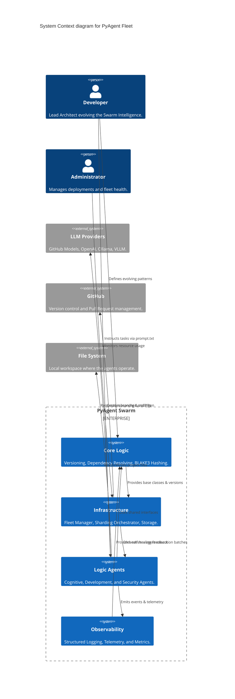

# Architecture: System Context

This diagram provides a high-level overview of the PyAgent Fleet architecture, mapping the inter-dependencies between major system boundaries.

## System Context Diagram

## Boundaries

| Boundary | Description | Key Modules |
|----------|-------------|-------------|
| **Core** | Fundamental logic, versioning, and workspace integrity. | `DependencyGraph`, `IncrementalProcessor`, `version.py` |
| **Infrastructure** | Fleet orchestration, sharding, and external resource management. | `AsyncFleetManager`, `ShardingOrchestrator`, `SecretManager` |
| **Logic** | The specialized agents performing the evolution tasks. | `CognitiveAgents`, `CoderAgent`, `SecurityAuditAgent` |
| **Observability** | Telemetry, logging, and metrics aggregation. | `StructuredLogger`, `OTelManager`, `GPUMonitor` |

---
*Generated automatically by `ArchitectureMapper.py` (Phase 236)*
