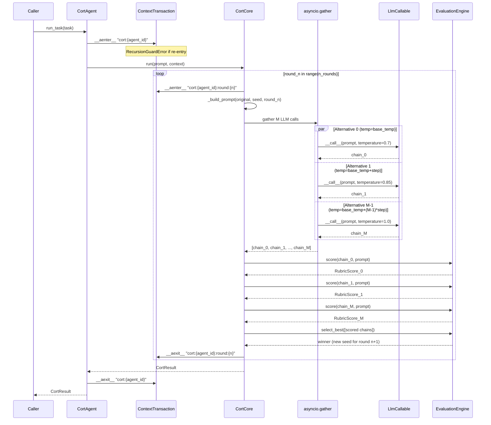

# cort-reasoning-pipeline — Design

_Status: IN_PROGRESS_
_Designer: @3design | Updated: 2026-03-26_

---

## Selected Option

**Loop:** Option A — Fixed N Rounds, Fixed M Alternatives  
**Evaluator:** E2 — Rubric-based heuristics (zero extra LLM calls) with E3 interface
contract (`use_llm_judge` flag) for V2 extensibility  
**Rationale:** Option A is trivially provable correct, maximally testable (deterministic
call count), and imposes a firm `N × M ≤ 15` cost budget. The adaptive variant (Option B)
requires score-range calibration that depends on the EvaluationEngine implementation;
deferring to V2 avoids a coupling risk. Heuristic scoring keeps V1 token cost at exactly
`N × M` calls while the `use_llm_judge` interface flag preserves a clean upgrade path.

---

## Architecture

```
┌──────────────────────────────────────┐
│           CortAgent                   │
│  (public entry point: run_task,       │
│   reason_with_cort via CortMixin)     │
│                                       │
│  Opens ContextTransaction             │
│  Delegates to CortCore.run()          │
└─────────────────┬────────────────────┘
                  │
                  ▼
┌──────────────────────────────────────┐
│           CortCore                    │
│  for round_n in range(n_rounds):      │
│    await asyncio.gather(              │
│      llm(prompt, temp_0),             │
│      llm(prompt, temp_1), ...         │  M calls in parallel
│    )  → list[ReasoningChain]          │
│    evaluator.select_best(chains)      │
│    winner seeds next round            │
│  returns CortResult                   │
└──────┬──────────────────┬────────────┘
       │                  │
       ▼                  ▼
┌─────────────┐  ┌──────────────────────┐
│ LlmCallable │  │  EvaluationEngine     │
│ (Protocol)  │  │  score() heuristics   │
│ vLLM / OAI  │  │  select_best()        │
│ compatible  │  │  (use_llm_judge V2)   │
└─────────────┘  └──────────────────────┘
```

### Key design rules

1. **Core/Agent separation** — all domain logic lives in `CortCore`; `CortAgent` only
   does orchestration, transaction management, and state tracking.
2. **Async-first** — all LLM calls use `asyncio.gather` for per-round parallelism;
   heuristic scoring is sync but called from async context.
3. **Protocol-based LLM abstraction** — `LlmCallable(Protocol)` is the only coupling
   between `CortCore` and any backend. No import of `FlmChatAdapter` inside
   `src/core/reasoning/`.
4. **In-memory only** — inter-round seed state is a local variable; no `MemoryTransaction`
   or `StorageTransaction` needed for V1.
5. **Recursion guard** — stable context ID `f"cort:{agent_id}"` blocks re-entry from
   within a running CoRT session; per-round IDs `f"cort:{agent_id}:round:{n}"` track
   lineage independently without blocking concurrent agents.

---

## Module Structure

```
src/core/reasoning/
├── __init__.py          — public re-exports
├── CortCore.py          — recursive loop domain logic
├── CortAgent.py         — agent orchestration + CortMixin
└── EvaluationEngine.py  — heuristic scorer + RubricScore
```

### `src/core/reasoning/__init__.py`

**Responsibility:** Re-export the public API. Nothing else.

```python
from src.core.reasoning.CortCore import CortCore
from src.core.reasoning.CortAgent import CortAgent, CortMixin
from src.core.reasoning.EvaluationEngine import EvaluationEngine, RubricScore
from src.core.reasoning.CortCore import (
    LlmCallable,
    CortConfig,
    CortResult,
    CortRound,
    ReasoningChain,
    DEFAULT_CORT_CONFIG,
)
from src.core.reasoning.CortCore import CortRecursionError, CortLimitExceeded
from src.core.reasoning.EvaluationEngine import AlternativesGenerationError

__all__ = [
    "CortCore",
    "CortAgent",
    "CortMixin",
    "EvaluationEngine",
    "RubricScore",
    "LlmCallable",
    "CortConfig",
    "CortResult",
    "CortRound",
    "ReasoningChain",
    "DEFAULT_CORT_CONFIG",
    "CortRecursionError",
    "CortLimitExceeded",
    "AlternativesGenerationError",
]
```

### `src/core/reasoning/CortCore.py`

**Responsibility:** Implements the fixed N-round × M-alternative reasoning loop.
Contains all data models, the `LlmCallable` protocol, `CortConfig`, and all custom
exceptions. Has no imports from `CortAgent.py`.

### `src/core/reasoning/EvaluationEngine.py`

**Responsibility:** Scores a single reasoning chain against three rubric axes using
text-based heuristics. No LLM calls in V1. `select_best()` picks the highest-scoring
alternative with deterministic tie-breaking by index.

### `src/core/reasoning/CortAgent.py`

**Responsibility:** Wraps `CortCore` inside `ContextTransaction`. Provides `CortMixin`
for multiple-inheritance usage and `CortAgent` as a fully standalone `BaseAgent`
subclass. No domain logic — all reasoning delegated to `CortCore`.

---

## Data Models

All dataclasses carry `__slots__ = ()` to avoid accidental attribute creation.

### `ReasoningChain`

```python
@dataclass(frozen=True, slots=True)
class ReasoningChain:
    text: str            # raw LLM response text
    score: float         # composite rubric score (0.0–10.0), 0.0 before evaluation
    round_n: int         # 0-indexed round this chain was generated in
    temperature: float   # temperature used to generate this chain
    alternative_idx: int # 0-indexed position within the round (tie-breaking key)
```

### `CortRound`

```python
@dataclass(frozen=True, slots=True)
class CortRound:
    round_n: int                        # 0-indexed
    prompt_used: str                    # exact prompt sent to the LLM (includes seed context)
    alternatives: tuple[ReasoningChain, ...]  # all M chains generated, scored
    winner: ReasoningChain              # highest-scored chain (seed for next round)
```

### `CortResult`

```python
@dataclass(frozen=True, slots=True)
class CortResult:
    best_chain: ReasoningChain          # winner of the final round
    all_rounds: tuple[CortRound, ...]   # complete history (len == n_rounds_executed)
    metadata: CortMetadata              # configuration snapshot + timing
```

### `CortMetadata`

```python
@dataclass(frozen=True, slots=True)
class CortMetadata:
    agent_id: str
    config: CortConfig
    rounds_executed: int    # may be < n_rounds if all alternatives failed in a round
    total_llm_calls: int    # actual calls made (rounds_executed × m_alternatives)
    elapsed_seconds: float
```

### `RubricScore`

```python
@dataclass(frozen=True, slots=True)
class RubricScore:
    correctness: float       # 0.0–10.0
    completeness: float      # 0.0–10.0
    reasoning_depth: float   # 0.0–10.0
    weighted_total: float    # 0.5*c + 0.3*p + 0.2*r; range 0.0–10.0

    @classmethod
    def zero(cls) -> "RubricScore": ...
```

### `CortConfig`

```python
@dataclass(frozen=True, slots=True)
class CortConfig:
    n_rounds: int           = 3      # 1–5
    m_alternatives: int     = 3      # 1–5
    base_temp: float        = 0.7    # starting temperature
    temp_step: float        = 0.15   # increment per alternative
    max_temp: float         = 1.2    # hard ceiling for temperature
    max_tokens: int         = 1024   # passed to LLM per call
    # Weights (must sum to 1.0)
    w_correctness: float    = 0.5
    w_completeness: float   = 0.3
    w_reasoning_depth: float = 0.2
    # V2 stubs (present in interface, ignored in V1)
    early_stop_threshold: float | None = None
    use_llm_judge: bool     = False

    def __post_init__(self) -> None:
        if not (1 <= self.n_rounds <= 5):
            raise ValueError("n_rounds must be 1–5")
        if not (1 <= self.m_alternatives <= 5):
            raise ValueError("m_alternatives must be 1–5")
        if self.n_rounds * self.m_alternatives > 15:
            raise CortLimitExceeded(
                f"n_rounds × m_alternatives = "
                f"{self.n_rounds * self.m_alternatives} exceeds hard cap of 15"
            )
```

### Default configuration

```python
DEFAULT_CORT_CONFIG = CortConfig(
    n_rounds=3,
    m_alternatives=3,
    base_temp=0.7,
    temp_step=0.15,
    max_tokens=1024,
    early_stop_threshold=None,   # V2
    use_llm_judge=False,         # V2
)
```

---

## Interfaces & Contracts

### `LlmCallable` Protocol

```python
class LlmCallable(Protocol):
    async def __call__(
        self,
        prompt: str,
        *,
        temperature: float,
        max_tokens: int,
    ) -> str:
        """Invoke the LLM and return the response as a plain string.

        Implementations must be safe to call concurrently from asyncio.gather.
        """
        ...
```

**Rationale for `prompt: str` rather than `messages: list[dict]`:** `CortCore`
assembles the full seed-aware prompt as a single string. This keeps the protocol
surface minimal and backend-agnostic. Adapters can wrap any underlying API format.

### `CortCore`

```python
class CortCore:
    def __init__(
        self,
        llm: LlmCallable,
        evaluator: EvaluationEngine,
        config: CortConfig = DEFAULT_CORT_CONFIG,
    ) -> None: ...

    async def run(
        self,
        prompt: str,
        context: str = "",
    ) -> CortResult:
        """Execute the full N-round × M-alternative reasoning loop.

        Parameters
        ----------
        prompt:  The original task/question string.
        context: Optional external context prepended to the prompt on round 1.

        Returns
        -------
        CortResult with the winning chain, full round history, and metadata.
        """
        ...

    async def _run_round(
        self,
        prompt: str,
        seed: ReasoningChain,
        round_n: int,
    ) -> CortRound:
        """Execute one round: generate M alternatives, score, select winner."""
        ...

    async def _generate_alternatives(
        self,
        prompt: str,
        seed_chain: str,
        round_n: int,
    ) -> list[ReasoningChain]:
        """Generate M alternatives via asyncio.gather at varied temperatures.

        On partial failure (some LLM calls raise), successful results are still
        usable. If ALL calls fail, raises AlternativesGenerationError.
        """
        ...

    @staticmethod
    def _build_prompt(
        original: str,
        seed: str,
        round_n: int,
        context: str = "",
    ) -> str:
        """Construct the prompt string for a single LLM call."""
        ...

    @staticmethod
    def estimated_calls(n_rounds: int, m_alternatives: int) -> int:
        """Return the total LLM call count for given parameters."""
        return n_rounds * m_alternatives
```

#### `CortCore.run()` algorithm

```
# Pre-condition: CortConfig validated at construction (caps enforced)

best_chain = ReasoningChain(text="", score=0.0, round_n=-1, temperature=0.0, alternative_idx=0)

for round_n in range(config.n_rounds):
    round_result = await _run_round(prompt, best_chain, round_n)
    best_chain = round_result.winner
    rounds_history.append(round_result)
    # V2 early-stop hook: if delta < threshold → break

return CortResult(best_chain, tuple(rounds_history), metadata)
```

#### `_run_round()` algorithm

```
prompt_used = _build_prompt(original_prompt, seed.text, round_n, context)

temperatures = [
    min(config.base_temp + i * config.temp_step, config.max_temp)
    for i in range(config.m_alternatives)
]

# Parallel generation
raw_texts = await asyncio.gather(
    *[llm(prompt_used, temperature=t, max_tokens=config.max_tokens)
      for t in temperatures],
    return_exceptions=True,
)

# Separate successes from failures; raise if all failed
chains = []
for idx, result in enumerate(raw_texts):
    if isinstance(result, Exception):
        log warning
    else:
        chain = ReasoningChain(text=result, score=0.0, round_n=round_n,
                               temperature=temperatures[idx], alternative_idx=idx)
        chains.append(chain)

if not chains:
    raise AlternativesGenerationError(f"Round {round_n}: all M alternatives failed")

# Score and select
scored_chains = [
    evaluator.score(c.text, prompt_used)
    and replace(c, score=rubric.weighted_total)
    for c in chains
]
winner = evaluator.select_best(scored_chains)

return CortRound(round_n, prompt_used, tuple(scored_chains), winner)
```

### `EvaluationEngine`

```python
class EvaluationEngine:
    def __init__(
        self,
        use_llm_judge: bool = False,
        llm: LlmCallable | None = None,
        w_correctness: float = 0.5,
        w_completeness: float = 0.3,
        w_reasoning_depth: float = 0.2,
    ) -> None: ...

    def score(
        self,
        chain: str,
        prompt: str = "",
    ) -> RubricScore:
        """Score a single reasoning chain on all three rubric axes.

        V1: pure heuristics. V2: routes to LLM judge when use_llm_judge=True.
        Always synchronous in V1 (heuristics are <1 ms).
        """
        ...

    def _score_correctness(self, chain: str) -> float:
        """Heuristic proxy for factual correctness.

        Penalises self-correction phrases ('I was wrong', 'actually no', 'wait'),
        counts logical negation of prior claims, rewards assertion density.
        Returns 0.0–10.0.
        """
        ...

    def _score_completeness(self, chain: str, prompt: str) -> float:
        """Heuristic proxy for completeness.

        Measures prompt-keyword recall rate, sentence count relative to
        prompt complexity (word count proxy), and presence of a conclusion.
        Returns 0.0–10.0.
        """
        ...

    def _score_reasoning_depth(self, chain: str) -> float:
        """Heuristic proxy for reasoning depth.

        Counts logical connectives ('because', 'therefore', 'since', 'given that'),
        numbered/bulleted step sequences, code block presence for code prompts.
        Returns 0.0–10.0.
        """
        ...

    def select_best(self, chains: list[ReasoningChain]) -> ReasoningChain:
        """Return the highest-scoring chain, with tie-breaking by alternative_idx (ascending)."""
        ...
```

### `CortMixin`

```python
class CortMixin:
    """Adds reason_with_cort() to any BaseAgent subclass via multiple inheritance.

    The host class must expose self._cort_core: CortCore.
    CortAgent provides this; custom agents must set it manually.
    """

    async def reason_with_cort(
        self,
        prompt: str,
        **kwargs: Any,
    ) -> CortResult:
        """Run the CoRT reasoning loop for a given prompt.

        Opens an outer ContextTransaction to prevent re-entrant calls.
        """
        ...
```

### `CortAgent`

```python
class CortAgent(BaseAgent, CortMixin):
    """Standalone CoRT agent and mixin base.

    Standalone usage:
        agent = CortAgent("my-agent", llm=adapter.complete)
        result = await agent.run_task("Explain X")

    Mixin usage:
        class SmartCoder(CortAgent, BaseAgent):
            async def run_task(self, task: str) -> CortResult:
                return await self.reason_with_cort(task)
    """

    def __init__(
        self,
        agent_id: str,
        llm: LlmCallable,
        config: CortConfig | None = None,
        evaluator: EvaluationEngine | None = None,
    ) -> None:
        """Construct the agent with an LLM callable and optional config override."""
        ...

    async def run_task(self, task: str) -> CortResult:
        """Entry point: route task through the CoRT loop via reason_with_cort()."""
        ...
```

---

## Sequence Diagram



---

## ContextTransaction Usage

### Transaction nesting strategy

```
Outer TX:  ContextTransaction(f"cort:{agent_id}")
           Purpose: blocks any re-entrant call to CoRT for the same agent instance.
           Stable ID — does NOT include a UUID suffix.
           Raises RecursionGuardError (from ContextTransactionManager) immediately on re-entry.

Inner TXs: ContextTransaction(f"cort:{agent_id}:round:{n}")
           Purpose: per-round lineage tracking for observability and parent attribution.
           Opened/closed within each iteration of the rounds loop.
           Does NOT block parallel execution: different round IDs ≠ same ID check.
```

### Code contract

```python
# In CortMixin.reason_with_cort (outer guard):
async with ContextTransaction(f"cort:{self.agent_id}"):
    # If this line is reached while the same context is already active,
    # ContextTransaction raises RecursionGuardError before entering.
    return await self._cort_core.run(prompt)

# In CortCore._run_round (inner tracking):
async with ContextTransaction(f"cort:{agent_id}:round:{round_n}"):
    alternatives = await self._generate_alternatives(...)
    winner = self.evaluator.select_best(alternatives)
    return CortRound(...)
```

### Infinite-loop detection

`ContextTransactionManager` uses `contextvars.ContextVar` for per-asyncio-task
isolation. Re-entry detection is O(1) set membership: if `context_id ∈ _active_var`,
`RecursionGuardError` is raised immediately. Two concurrent agents running CoRT in
separate asyncio tasks do **not** interfere because each task has its own copy of
`_active_var`.

**Depth > 1 scenario:** If code inside a CoRT session somehow calls `reason_with_cort`
again on the same agent (e.g., a tool call routes back through the same `CortAgent`
instance), the outer `ContextTransaction(f"cort:{agent_id}")` is already in the active
set → `RecursionGuardError` is raised immediately. This is intentional: the caller must
catch this and decide whether to proceed without CoRT or fail.

---

## Error Handling

### Custom exceptions

```python
class CortRecursionError(RecursionGuardError):
    """Re-entrant CoRT call detected on the same agent instance.

    Raised by ContextTransaction when the outer 'cort:{agent_id}' context_id
    is already active. Inherits from RecursionGuardError so callers that catch
    the base class continue to work correctly.
    """

class CortLimitExceeded(ValueError):
    """n_rounds × m_alternatives exceeds the hard cap of 15.

    Raised at CortConfig construction time, never at run time.
    """

class AlternativesGenerationError(RuntimeError):
    """All M LLM calls for a single round failed simultaneously.

    Partial failures (some calls succeed) are handled gracefully — only
    the successful chains are passed to EvaluationEngine. This exception
    is raised only when zero chains were produced.
    When raised, CortCore returns the previous seed chain unchanged as the
    'winner' of that round (fallback behaviour).
    """
```

### Failure matrix

| Failure scenario | Detection | Handling |
|---|---|---|
| Re-entrant CoRT call | `RecursionGuardError` from outer `ContextTransaction` | Propagates as `CortRecursionError`; caller must handle |
| `n_rounds × m_alternatives > 15` | `CortConfig.__post_init__` | Raises `CortLimitExceeded` at construction (not runtime) |
| 1–(M-1) LLM calls fail in a round | `isinstance(result, Exception)` in `asyncio.gather` results | Logs warning; partial results proceed to scoring |
| All M LLM calls fail in a round | Zero chains after filtering | `AlternativesGenerationError`; CortCore catches it and returns prior seed unchanged |
| EvaluationEngine receives empty chain | Guard in `_score_*` methods | Returns `RubricScore.zero()` (0.0 composite); such chains lose `select_best` naturally |
| Score tie among alternatives | `select_best` stable sort | Lower `alternative_idx` wins (lower index → lower temperature → more focused response) |

---

## Configuration Defaults

```python
DEFAULT_CORT_CONFIG = CortConfig(
    n_rounds=3,
    m_alternatives=3,
    base_temp=0.7,
    temp_step=0.15,
    max_tokens=1024,
    w_correctness=0.5,
    w_completeness=0.3,
    w_reasoning_depth=0.2,
    early_stop_threshold=None,   # V2: adaptive stopping
    use_llm_judge=False,         # V2: LLM-as-judge evaluation
)
```

**Hard caps enforced in `CortConfig.__post_init__`:**

| Parameter | Min | Max | Default |
|---|---|---|---|
| `n_rounds` | 1 | 5 | 3 |
| `m_alternatives` | 1 | 5 | 3 |
| `n_rounds × m_alternatives` | 1 | 15 | 9 |
| `max_tokens` | 64 | 8192 | 1024 |
| `base_temp` | 0.0 | 1.5 | 0.7 |
| `temp_step` | 0.0 | 0.3 | 0.15 |

---

## Test Hooks

Mock and fixture requirements for `@5test`:

### `LlmCallable` mock

```python
class DeterministicLlm:
    """Returns a fixed response keyed by (round_n, alternative_idx, temperature).

    Injected into CortCore constructor. Call count tracked via self.calls list.
    Usage in tests:
        llm = DeterministicLlm(responses={0.7: "chain_A", 0.85: "chain_B", 1.0: "chain_C"})
        core = CortCore(llm=llm, evaluator=real_evaluator)
        result = await core.run("test prompt")
        assert len(llm.calls) == DEFAULT_CORT_CONFIG.n_rounds * DEFAULT_CORT_CONFIG.m_alternatives
    """
    def __init__(self, responses: dict[float, str]): ...
    async def __call__(self, prompt: str, *, temperature: float, max_tokens: int) -> str: ...
```

### `EvaluationEngine` fixture

`EvaluationEngine` uses only `re` and stdlib — no mocking required. Tests use
**known text fixtures** designed to score predictably:

```python
DEEP_CHAIN    = "Step 1: ... because ... therefore ... Step 2: ..."    # high reasoning depth
SHALLOW_CHAIN = "The answer is 42."                                     # low on all axes
COMPLETE_CHAIN = "The question asks about X. X is defined as... In conclusion..."  # high completeness
CONTRADICTORY  = "X is true. Wait, actually X is false."               # low correctness
```

### ContextTransaction patching

For testing `CortRecursionError`:

```python
# Standard: use real ContextTransaction (no mock needed for happy path)
# Re-entry test: call reason_with_cort from within an active CortAgent.run_task context.
# To skip transaction overhead in unit tests that don't test re-entry:
#   monkeypatch src.core.reasoning.CortAgent.ContextTransaction with a no-op async CM.
```

### Round count verification

```python
async def test_runs_exactly_n_rounds(llm_mock, evaluator):
    core = CortCore(llm=llm_mock, evaluator=evaluator, config=CortConfig(n_rounds=2, m_alternatives=2))
    result = await core.run("prompt")
    assert len(result.all_rounds) == 2
    assert llm_mock.call_count == 4   # 2 rounds × 2 alternatives
```

---

## V1 / V2 Boundary

### V1 (this sprint)

| Component | Scope |
|---|---|
| `CortCore` — fixed N-round × M-alternative loop | ✅ implement |
| `EvaluationEngine` — heuristic scorer (three axes, stdlib only) | ✅ implement |
| `CortAgent` — standalone agent + `CortMixin` for multiple inheritance | ✅ implement |
| `LlmCallable` Protocol | ✅ implement |
| All data models: `ReasoningChain`, `CortRound`, `CortResult`, `CortConfig`, `RubricScore` | ✅ implement |
| `DEFAULT_CORT_CONFIG` | ✅ implement |
| Error classes: `CortRecursionError`, `CortLimitExceeded`, `AlternativesGenerationError` | ✅ implement |
| Hard caps (rounds ≤ 5, alternatives ≤ 5, N×M ≤ 15) | ✅ implement |
| `ContextTransaction` outer + per-round inner wrapping | ✅ implement |
| `use_llm_judge` flag present in interface but ignored | ✅ implement (stub) |
| `early_stop_threshold` field present in `CortConfig`, ignored when `None` | ✅ implement (stub) |

### V2 (deferred)

| Component | Deferred reason |
|---|---|
| Adaptive early-stop (`early_stop_threshold` active) | Requires score-calibration against E2 range; defer until E3 is live |
| LLM-judge evaluator (`use_llm_judge=True` path) | Doubles token cost; needs sycophancy mitigation design first |
| Prompt-level result caching via `MemoryTransaction` | In-memory simple variable sufficient for V1; caching is optimization |
| Tournament bracket (pairwise elimination) | High complexity, O(N×M²) cost; not needed for PyAgent task types in V1 |
| `CortMetadata.elapsed_seconds` precision timing | Observability enhancement; stub with `0.0` for V1 |

---

## Non-Functional Requirements

### Performance
- All M LLM calls within a round execute in parallel via `asyncio.gather`; wallclock
  latency per round ≈ single LLM call latency (not M × latency).
- Heuristic scoring is synchronous and executes in < 1 ms per chain; no `asyncio`
  overhead needed for scoring in V1.
- `CortConfig` validation (cap check) is O(1) at construction time.

### Security
- `CortCore` accepts an injected `LlmCallable` — no dynamic import, no eval, no
  subprocess for LLM calls.
- `prompt` and `chain` text are never executed as code; only passed as string data.
- Temperature and max_tokens are bounded by `CortConfig` caps before being used in
  LLM calls.
- No secrets or credentials flow through `CortCore` — all auth is handled by the
  injected LLM callable.

### Testability
- `CortCore` is deterministic given a deterministic `LlmCallable` mock.
- `EvaluationEngine` is a pure function (stateless) on heuristic axes — no mocks needed.
- `ContextTransaction` is the only external dependency in `CortAgent`; it can be
  replaced with a no-op async context manager for unit tests that do not test re-entry.
- All custom exceptions are importable from `src.core.reasoning` without instantiating
  any agent.

### Flake8 / style compliance
- All files in `src/core/reasoning/` must pass `flake8 .` with zero violations.
- Line length limit: 120 characters (per `pyproject.toml` `max-line-length`).
- Each file carries the Apache 2.0 license header.

---

## Open Questions for @4plan

1. `CortAgent.run_task()` auto-routing: should the standalone `run_task(task)` always
   route through CoRT, or expose an opt-in flag `use_cort: bool = True`? **Recommend
   default True** (the purpose of `CortAgent` is CoRT reasoning).

2. `CortCore._build_prompt()` seed format: does the seed chain appear as a system
   message prefix, a user turn, or an explicit assistant turn? The sequence for round N
   should be: system=task description, user=original prompt, assistant=prior best chain
   → user=refine instruction. Exact template is an implementation detail for @6code.

3. `src/core/reasoning/__init__.py` lazy imports: should it use absolute imports
   (`from src.core.reasoning.CortCore import ...`) or relative (`from .CortCore import ...`)?
   Use relative imports for package-internal consistency.

_Status: DONE_
_Designer: @3design | Updated: 2026-03-26_
