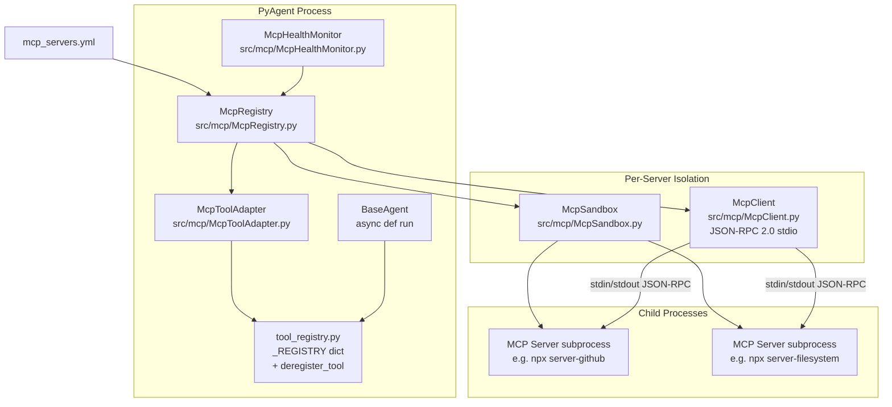

# mcp-server-ecosystem — Design

_Status: DONE_
_Designer: @3design | Updated: 2026-03-26_

---

## Selected Option

**Option A — Subprocess + stdio transport with Python-userspace sandbox**

Rationale: ~70% of community MCP servers use stdio; subprocess is zero-friction on
Windows (critical for this dev environment) and CI. Hot-reload is trivial (kill →
respawn → re-initialize). The supply-chain threat is mitigated by allowlist + SHA-256
pinning, not by kernel isolation, which is acceptable for the target threat model of
trusted community servers. `McpClient` is designed transport-agnostic from day one so
HTTP/SSE (Option B strength) can be unlocked later with no registry API changes.

---

## Architecture Overview

### Block Diagram



### Tool Invocation Data Flow

A complete round-trip from agent to MCP server and back:

```
1.  BaseAgent.run(task)
      └─► await async_run_tool("mcp::github::create_issue", args)   [tool_registry.py]
            └─► tool.main(args)                                       [McpToolAdapter closure]
                  └─► await McpClient.call_tool("create_issue", params)
                        ├─ asyncio.wait_for(timeout=config.timeout_seconds)
                        ├─ writes: {"jsonrpc":"2.0","id":1,"method":"tools/call",
                        │           "params":{"name":"create_issue","arguments":{...}}}\n
                        │   → child stdin
                        └─ reads:  {"jsonrpc":"2.0","id":1,"result":{"content":[...]}}\n
                            ← child stdout
                  └─► McpToolResult  →  returns to agent
```

### Startup Sequence (Eager Mode — default)

```
1. McpRegistry.load_config("mcp_servers.yml")
     └─► parse YAML → list[McpServerConfig]
2. for each config.enabled == True:
     McpRegistry.enable(name)
       └─► McpSandbox.spawn(config) → asyncio.subprocess.Process
       └─► McpClient.initialize()   → capability handshake
       └─► McpToolAdapter.register_server_tools(name, client)
             └─► client.list_tools() → list[McpToolDefinition]
             └─► for each tool: register_tool("mcp::<name>::<tool>", async_main, desc)
3. McpHealthMonitor.start(registry)  → background heartbeat task
```

### Hot-Reload Sequence

```
McpRegistry.reload("github")
  └─► McpRegistry.disable("github")          [drain + deregister + terminate]
        ├─► _drain_lock acquired
        ├─► await _in_flight_semaphore (wait for 0 active calls)
        ├─► McpToolAdapter.deregister_server_tools("github")
        │     └─► deregister_tool("mcp::github::*") via copy-on-write swap
        └─► McpSandbox.terminate(process)     [SIGTERM → 5s timeout → SIGKILL]
  └─► McpRegistry.enable("github")           [spawn + init + register]
```

---

## Module Interfaces & Contracts

All modules live under `src/mcp/`. File names use `PascalCase` per project convention.

### `src/mcp/McpServerConfig.py`

```python
from __future__ import annotations
from dataclasses import dataclass, field

@dataclass
class McpServerConfig:
    name: str                          # unique server ID (URL-safe slug)
    command: list[str]                 # e.g. ["node", "dist/index.js"]
    env_vars: dict[str, str]           # non-secret env injections (key=value literals)
    secret_refs: list[str]             # env var names to pull from PyAgent's own env
    allowed_paths: list[str]           # filesystem paths this server may read (empty = deny all)
    allowed_hosts: list[str]           # network hosts server may reach (empty = deny all)
    timeout_seconds: float             # per-call asyncio.wait_for timeout
    restart_policy: str                # "always" | "on-failure" | "never"
    sha256_pin: str | None             # optional SHA-256 hex of the server binary
    transport: str = "stdio"           # "stdio" | "http" (future)
    startup_mode: str = "eager"        # "eager" | "lazy"
    enabled: bool = True
    heartbeat_interval_seconds: float = 30.0
    max_restart_attempts: int = 3
```

### `src/mcp/McpRegistry.py`

```python
class McpRegistry:
    """Hot-load lifecycle manager for all configured MCP servers."""

    async def load_config(self, path: str) -> None:
        """Parse mcp_servers.yml; populate internal server map.

        Raises McpConfigError on schema validation failure.
        Idempotent: re-calling merges new config without disabling running servers.
        """

    async def enable(self, name: str) -> None:
        """Spawn subprocess, run initialize handshake, register tools.

        Raises McpServerNotFound if name not in config.
        Raises McpServerAlreadyEnabled if server is running.
        """

    async def disable(self, name: str) -> None:
        """Drain in-flight calls, deregister tools, terminate subprocess.

        Raises McpServerNotEnabled if server is not running.
        Blocks until all in-flight calls for this server complete (up to
        disable_drain_timeout_seconds, default 10 s), then forcibly terminates.
        """

    async def reload(self, name: str) -> None:
        """Hot-reload: disable then enable. Atomic from caller's perspective."""

    def list_servers(self) -> list[McpServerConfig]:
        """Synchronous snapshot of all configured servers (running and stopped)."""

    def get_client(self, name: str) -> McpClient:
        """Return the active McpClient for a running server.

        Raises McpServerNotEnabled if not running.
        """

    def get_status(self, name: str) -> McpServerStatus:
        """Return current status: STOPPED | STARTING | RUNNING | DRAINING | RESTARTING."""
```

### `src/mcp/McpSandbox.py`

```python
class McpSandbox:
    """Produce and manage subprocess lifecycle with a sanitised environment."""

    async def spawn(self, config: McpServerConfig) -> asyncio.subprocess.Process:
        """Launch child subprocess with sanitised env and stdio pipes.

        Sanitisation steps:
          1. Start from empty env dict.
          2. Inject only config.env_vars (literal values).
          3. For each name in config.secret_refs: copy from os.environ[name].
             Raise McpSecretNotFound if a declared secret_ref is absent from PyAgent env.
          4. Set PATH to the directory of the first element of config.command only
             (prevents PATH-hijacking by the server).
          5. Validate sha256_pin against the binary at config.command[0] if set.
             Raise McpPinMismatch on mismatch.

        Returns the asyncio.subprocess.Process. Caller owns lifecycle.
        """

    async def terminate(self, process: asyncio.subprocess.Process) -> None:
        """Graceful terminate: send SIGTERM, await 5 s, then SIGKILL.

        On Windows: process.terminate() (CTRL_BREAK_EVENT), then process.kill().
        Always awaits process.wait() to reap the zombie.
        """

    def validate_path(self, path: str, config: McpServerConfig) -> None:
        """Assert path is within config.allowed_paths after symlink resolution.

        Raises McpPathForbidden if not. Called by McpToolAdapter before dispatching
        tool calls with path arguments.
        """

    def build_env(self, config: McpServerConfig) -> dict[str, str]:
        """Return the sanitised env dict without spawning. Used for unit tests."""
```

### `src/mcp/McpClient.py`

```python
class McpClient:
    """Async JSON-RPC 2.0 client over stdin/stdout (stdio transport)."""

    def __init__(
        self,
        process: asyncio.subprocess.Process,
        config: McpServerConfig,
    ) -> None: ...

    async def initialize(self) -> McpCapabilities:
        """Send MCP initialize request; await initialized notification.

        Raises McpProtocolError on version mismatch.
        Raises McpCallTimeout if handshake exceeds config.timeout_seconds.
        """

    async def list_tools(self) -> list[McpToolDefinition]:
        """Send tools/list; return parsed tool definitions.

        Raises McpServerCrashed if process has exited.
        """

    async def call_tool(
        self,
        name: str,
        arguments: dict[str, object],
    ) -> McpToolResult:
        """Send tools/call; await response.

        Raises McpCallTimeout on asyncio.wait_for expiry.
        Raises McpProtocolError on malformed JSON-RPC response.
        Raises McpServerCrashed if process exits mid-call.
        Raises McpToolError if server returns an error result.

        All calls are wrapped in asyncio.wait_for(timeout=config.timeout_seconds).
        """

    async def ping(self) -> bool:
        """Send MCP ping; return True on pong within timeout.

        Returns False (does NOT raise) on timeout or process exit.
        Used by McpHealthMonitor for liveness checks.
        """

    async def close(self) -> None:
        """Flush pending writes, close stdio pipes. Does not terminate process."""
```

**Wire format** (newline-delimited JSON-RPC 2.0 over stdio):

```
→ {"jsonrpc":"2.0","id":1,"method":"tools/call","params":{"name":"create_issue","arguments":{"title":"...","body":"..."}}}\n
← {"jsonrpc":"2.0","id":1,"result":{"content":[{"type":"text","text":"Issue #42 created"}]}}\n
```

### `src/mcp/McpToolAdapter.py`

```python
class McpToolAdapter:
    """Translates MCP ToolDefinition → PyAgent Tool; manages registry lifecycle."""

    def __init__(self, registry_ref: dict) -> None:
        # registry_ref is a reference to _REGISTRY from tool_registry; adapter
        # performs copy-on-write swaps through deregister_tool / register_tool.
        ...

    async def register_server_tools(
        self,
        server_name: str,
        client: McpClient,
        sandbox: McpSandbox,
        config: McpServerConfig,
    ) -> int:
        """Fetch tool list from client; register each as mcp::<server_name>::<tool_name>.

        Returns count of tools registered.
        Each registered Tool.main is an async closure bound to (client, tool_name, sandbox, config).
        The closure calls await async_client.call_tool(tool_name, parsed_args).
        Raises McpToolNameCollision if a non-MCP tool with the same namespaced name exists.
        """

    async def deregister_server_tools(self, server_name: str) -> int:
        """Remove all tools with prefix mcp::<server_name>:: from _REGISTRY.

        Uses copy-on-write dict swap (see Design Decision 2).
        Returns count of tools removed.
        """

    @staticmethod
    def tool_definition_to_spec(
        server_name: str,
        defn: McpToolDefinition,
    ) -> tuple[str, ToolMain, str]:
        """Convert MCP ToolDefinition → (namespaced_name, async_main, description).

        namespaced_name = f"mcp::{server_name}::{defn.name}"
        description     = defn.description or f"MCP tool from {server_name}"
        async_main      = async closure that calls McpClient.call_tool
        """
```

### `src/mcp/McpHealthMonitor.py`

```python
class McpHealthMonitor:
    """Background heartbeat task; triggers reload on failed liveness checks."""

    async def start(self, registry: McpRegistry) -> None:
        """Launch background asyncio.Task polling each enabled server.

        Poll interval: config.heartbeat_interval_seconds (default 30 s).
        On failed ping: log WARNING; call registry.reload(name).
        If reload fails (McpServerCrashed): log ERROR; honour restart_policy.
        restart_policy=="never": leave disabled, log CRITICAL.
        restart_policy=="on-failure": exponential backoff, max config.max_restart_attempts.
        restart_policy=="always": always retry with exponential backoff.
        """

    async def stop(self) -> None:
        """Cancel background task; await cancellation."""

    def get_health(self, server_name: str) -> McpServerHealth:
        """Synchronous snapshot: HEALTHY | DEGRADED | DOWN."""
```

### `src/mcp/__init__.py`

Public re-exports:

```python
from src.mcp.McpRegistry import McpRegistry
from src.mcp.McpServerConfig import McpServerConfig
from src.mcp.McpClient import McpClient, McpToolDefinition, McpToolResult
from src.mcp.McpSandbox import McpSandbox
from src.mcp.McpToolAdapter import McpToolAdapter
from src.mcp.McpHealthMonitor import McpHealthMonitor
from src.mcp.exceptions import (
    McpConfigError, McpServerNotFound, McpServerNotEnabled,
    McpServerAlreadyEnabled, McpServerCrashed, McpCallTimeout,
    McpProtocolError, McpToolError, McpPinMismatch, McpPathForbidden,
    McpSecretNotFound, McpToolNameCollision,
)
```

### `src/mcp/exceptions.py`

```python
class McpError(Exception): ...
class McpConfigError(McpError): ...          # YAML parse / validation failure
class McpServerNotFound(McpError): ...       # name not in config
class McpServerNotEnabled(McpError): ...     # not running; get_client() raises this
class McpServerAlreadyEnabled(McpError): ... # enable() called on running server
class McpServerCrashed(McpError): ...        # subprocess exited unexpectedly
class McpCallTimeout(McpError): ...          # asyncio.wait_for timeout
class McpProtocolError(McpError): ...        # malformed JSON-RPC
class McpToolError(McpError): ...            # server returned error result
class McpPinMismatch(McpError): ...          # SHA-256 pin did not match binary
class McpPathForbidden(McpError): ...        # path outside allowed_paths
class McpSecretNotFound(McpError): ...       # secret_ref absent from PyAgent env
class McpToolNameCollision(McpError): ...    # non-MCP tool occupies namespaced name
```

### `src/tools/tool_registry.py` — Required Additions

Two functions must be added (no other changes to existing code):

```python
def deregister_tool(name: str) -> None:
    """Remove a tool from the registry using copy-on-write swap.

    Thread-safety: performs an atomic dict copy and module-level reference swap
    under the GIL. In-flight callers that already resolved a Tool reference
    continue safely against the old dict snapshot.
    Raises KeyError if name not registered.
    """
    global _REGISTRY
    if name not in _REGISTRY:
        raise KeyError(f"Tool '{name}' is not registered")
    new_registry = {k: v for k, v in _REGISTRY.items() if k != name}
    _REGISTRY = new_registry  # atomic under CPython GIL


async def async_run_tool(name: str, args: list[str] | None = None) -> int:
    """Async-native tool dispatch. Preferred in async agent contexts.

    Directly awaits coroutine result; never calls asyncio.run().
    Falls back to sync execution for non-async tools.
    """
    tool = get_tool(name)
    if tool is None:
        raise KeyError(f"Unknown tool: {name}")
    result = tool.main(args)
    if inspect.isawaitable(result):
        return await result
    return result
```

---

## Config File Format

**Location:** `mcp_servers.yml` in the PyAgent working directory (or path
specified by `PYAGENT_MCP_CONFIG` env var, enabling per-environment override).

```yaml
# mcp_servers.yml
mcp_servers:
  - name: filesystem                   # unique server ID (URL-safe slug)
    command: ["npx", "-y", "@modelcontextprotocol/server-filesystem", "/workspace"]
    env_vars: {}                        # literal key=value env injections
    secret_refs: []                     # names of env vars to pull from PyAgent env
    allowed_paths: ["/workspace"]       # McpSandbox validates all path args against this
    allowed_hosts: []                   # empty = deny all outbound network
    timeout_seconds: 10.0
    restart_policy: on-failure          # always | on-failure | never
    sha256_pin: null                    # optional: hex SHA-256 of server binary
    transport: stdio                    # stdio | http (future)
    startup_mode: eager                 # eager | lazy
    heartbeat_interval_seconds: 30.0
    max_restart_attempts: 3
    enabled: true

  - name: github
    command: ["npx", "-y", "@modelcontextprotocol/server-github"]
    env_vars:
      GITHUB_API_URL: "https://api.github.com"
    secret_refs: ["GITHUB_TOKEN"]       # GITHUB_TOKEN read from PyAgent's own env
    allowed_paths: []
    allowed_hosts: ["api.github.com"]
    timeout_seconds: 30.0
    restart_policy: on-failure
    sha256_pin: null
    transport: stdio
    startup_mode: eager
    heartbeat_interval_seconds: 30.0
    max_restart_attempts: 3
    enabled: true
```

**Per-environment override pattern:** Ship `mcp_servers.yml` (base) and
`mcp_servers.ci.yml` / `mcp_servers.prod.yml`; select via
`PYAGENT_MCP_CONFIG=mcp_servers.ci.yml`. No in-file environment substitution —
keep the format simple and deterministic.

**Config watch for hot-reload:** `McpRegistry.load_config()` is idempotent.
Callers trigger reload explicitly via API call. File-watch polling is explicitly
out of scope to avoid cross-platform `watchdog` dependency complexity.

---

## Open Question Resolutions

### Design Decision 1 — Async Event Loop Boundary

**Question:** Does @3design commit `BaseAgent.run()` to `async def`, or must
`McpToolAdapter` carry a compatibility shim?

**Decision: Commit `BaseAgent.run()` to `async def` immediately.**

**Rationale:**

The root cause is `run_tool()` calling `asyncio.run()` on coroutines, which raises
`RuntimeError: This event loop is already running` when invoked from any async context.
There is no safe, general shim: `loop.run_until_complete()` fails identically inside a
running loop; `nest_asyncio` is a global monkey-patch with side effects on the whole
process.

The correct fix drives async all the way to the agent entrypoint:

1. `BaseAgent` adds `async def run(self, task: ...) -> ...:` as the canonical execution
   entrypoint (`abstractmethod`). The existing sync scaffold is replaced.
2. `src/tools/tool_registry.py` gains `async_run_tool()` (defined above).
   Agents call `await async_run_tool(...)` inside their `async def run()`.
3. The existing sync `run_tool()` is retained unchanged for CLI scripts and tests.
   It continues to use `asyncio.run()` which is correct in non-async contexts.
4. `McpToolAdapter` registers `async def main(args)` closures as the `ToolMain`.
   `run_tool()` from a CLI calls `asyncio.run(coroutine)` — correct.
   `async_run_tool()` from an agent awaits directly — correct. No shim required.

**Constraints on @6code:**

- `BaseAgent.run()` must be declared `async def` before MCP integration begins.
- All agent subclasses must update their `run()` override to `async def`.
- Call sites that invoke `agent.run()` must use `asyncio.run(agent.run(...))` at
  the process entrypoint, or be inside an existing event loop.
- `McpToolAdapter` closures must never call `asyncio.run()` internally.

---

### Design Decision 2 — `tool_registry` Deregistration API

**Question:** Thread-safety contract — copy-on-write dict swap vs `asyncio.Lock`?
In-flight call guarantee during reload?

**Decision: Copy-on-write dict swap (atomic reference replacement) with an
`asyncio.Lock`-guarded drain counter in `McpRegistry`.**

**Rationale:**

`_REGISTRY` is a module-level Python dict. Under CPython, a bare reference assignment
(`_REGISTRY = new_dict`) is atomic from the GIL's perspective. Any coroutine that
already resolved a `Tool` reference from the old dict holds it safely. New lookups
after the swap immediately see the updated dict. This gives:

- **Zero lock contention on the read path** — no lock in `get_tool()` or `run_tool()`.
- **Atomic from callers' perspective** — no partial-update window.
- **No in-flight call can see a half-removed tool** — they either resolved the tool
  before the swap (complete safely) or look it up after (get `None`, raise `KeyError`).

**In-flight drain contract (`McpRegistry` responsibility, not `tool_registry`'s):**

`McpRegistry` tracks per-server `_in_flight_count: int` (an `asyncio.Event`-backed
counter). Each tool closure increments the count on entry and decrements on exit.
`McpRegistry.disable(name)` procedure:

1. Sets server state to `DRAINING` — new tool calls immediately raise
   `McpServerNotEnabled` without incrementing the counter.
2. Awaits drain: waits for `_in_flight_count == 0`, with
   `disable_drain_timeout_seconds` (default 10 s) deadline.
3. After drain confirmed: calls `McpToolAdapter.deregister_server_tools(name)` (swap).
4. Calls `McpSandbox.terminate(process)`.

This guarantees **no in-flight call is cancelled mid-execution; all complete naturally
before the subprocess is killed.**

**Constraints on @6code:**

- `deregister_tool(name)` must perform `_REGISTRY = {k: v …}` copy-and-replace.
  Do NOT use `del _REGISTRY[name]` (mutates in-place; unsafe under concurrent read).
- `McpRegistry` must use `asyncio.Lock` to serialize concurrent `reload()` calls on
  the same server name.
- The in-flight counter must not use `asyncio.Semaphore` (which blocks acquisition
  when at zero); use a counter + `asyncio.Event` that fires when count reaches 0.

---

### Design Decision 3 — Credential Injection Security

**Question:** How are secrets stored and injected? Masking contract?

**Decision: Env-var pass-through from PyAgent's own environment as the primary
mechanism; `StorageTransaction`-encrypted file as an opt-in secondary.**

**Primary path — env-var pass-through:**

`config.secret_refs` lists variable names (e.g. `["GITHUB_TOKEN"]`). At spawn time,
`McpSandbox.build_env()` reads each name from `os.environ` (PyAgent's own process env)
and injects the value into the child's sanitised env dict. The config YAML stores
**only the variable name, never the value.** Operators set secrets via their existing
secrets management (CI secrets, `.env` file loaded at boot, OS keychain at login).
PyAgent's own env is already the security perimeter — this approach adds zero new
attack surface.

**Secondary path — StorageTransaction-encrypted file (opt-in, MVP-stub):**

```yaml
secret_refs:
  - name: GITHUB_TOKEN
    source: encrypted_file      # optional; default: env
    path: secrets/github.enc    # relative to PyAgent root
```

`McpSandbox` decrypts via `StorageTransactionManager`. This path is stubbed with
`NotImplementedError` in the MVP; the interface is defined now so @4plan can schedule
the implementation as a separate task.

**Masking contract (non-negotiable):**

1. Any env var name in `config.secret_refs` is treated as a **masked value** system-wide.
2. `McpSandbox.build_env()` produces a parallel `_masked_env: dict[str, str]` replacing
   every secret value with `"[REDACTED]"`. All log calls use `_masked_env`, never the
   live env.
3. `McpRegistry.get_status(name)` and all management API responses return `_masked_env`.
4. Structured log records must never serialize the live env dict.
5. Exception messages include only the variable name, not its value.

**Constraints on @6code:**

- `McpSandbox.spawn()` must derive and store `_masked_env` at construction time.
- `McpServerConfig` must never hold secret values — only `secret_refs` names.
- No `repr()` or `str()` of any env dict containing secret values may appear in logs.

---

## Non-Functional Requirements

### Performance
- Eager-mode server startup (spawn + MCP `initialize` handshake): < 2 s on developer
  workstation.
- First tool call overhead (already-running server): < 50 ms excluding server execution
  time.
- Hot-reload (`McpRegistry.reload()`, no in-flight calls): < 5 s; drain timeout: 10 s.
- Concurrent calls: `McpClient` must support ≥ 10 outstanding JSON-RPC requests per
  server simultaneously (message correlation by `id` field).
- Memory: `terminate()` must always reap the process; no dead process reference
  accumulation.

### Security
- SHA-256 pinning enforced at spawn time when `sha256_pin` is set.
- Server subprocess inherits only variables from `env_vars` + `secret_refs`. No host
  env variables (`PYTHONPATH`, `PATH` beyond binary dir, `HOME`, `TMPDIR`) pass
  through.
- No `shell=True` anywhere: always use `asyncio.create_subprocess_exec`.
- All path arguments in tool calls validated against `config.allowed_paths` before
  dispatch (in `McpToolAdapter` closure, before `McpClient.call_tool()`).
- Masked env used in all logging and API responses (Design Decision 3).

### Testability
- All modules accept injected dependencies (client, sandbox, process) for unit tests
  without spawning real subprocesses.
- `McpSandbox.build_env()` is a pure function; no side effects.
- `McpClient` transport is abstracted behind a `reader/writer` pair; tests inject
  `asyncio.StreamReader` / `asyncio.StreamWriter` fakes.
- `McpToolAdapter` accepts `_REGISTRY` dict as a constructor argument (default: module
  singleton) for isolated test registries.

---

## Error Handling

### Exception Propagation

```
McpError
├── McpConfigError          → load_config(); never reaches agent
├── McpServerNotFound       → enable/disable/get_client; operator API error
├── McpServerNotEnabled     → get_client(), tool closure; propagates to agent
├── McpServerAlreadyEnabled → enable(); caller should catch for idempotent calls
├── McpServerCrashed        → call_tool() when process.returncode is set;
│                             McpHealthMonitor catches and triggers reload
├── McpCallTimeout          → call_tool() via asyncio.wait_for; agent may retry
├── McpProtocolError        → call_tool() on malformed JSON-RPC; triggers WARNING+restart
├── McpToolError            → call_tool() on server error result; agent receives
├── McpPinMismatch          → spawn(); CRITICAL; server not started
├── McpPathForbidden        → tool closure pre-flight; agent receives
├── McpSecretNotFound       → build_env(); CRITICAL; server not started
└── McpToolNameCollision    → register_server_tools(); logged and skipped
```

### Observability Log Levels

| Event | Level |
|---|---|
| Server enabled / tools registered | INFO |
| Server disabled / tools deregistered | INFO |
| Hot-reload started / completed | INFO |
| Health check failed; server restarting | WARNING |
| Drain timeout exceeded; forced kill | WARNING |
| Subprocess crash (unexpected exit) | ERROR |
| `McpCallTimeout` triggering restart | ERROR |
| Config validation failure | ERROR |
| Server exhausted `max_restart_attempts` | CRITICAL |

All log records include structured fields: `server_name`, `tool_name` (where relevant),
`duration_ms`, `jsonrpc_id`.

---

## Testing Strategy

All test files live under `tests/unit/`.

### `tests/unit/test_McpRegistry.py`
- `test_load_config_valid` — well-formed YAML; assert `list_servers()` count
- `test_load_config_invalid_schema` — malformed YAML raises `McpConfigError`
- `test_enable_starts_subprocess` — mock sandbox + client; assert status → RUNNING
- `test_enable_already_enabled_raises` — `McpServerAlreadyEnabled`
- `test_disable_drains_before_terminate` — 1 in-flight call; assert terminate not called
  until call completes
- `test_disable_force_kills_after_drain_timeout` — in-flight never completes; assert
  force-kill after deadline
- `test_reload_calls_disable_then_enable` — verify call sequence via mocks
- `test_get_client_not_enabled_raises` — `McpServerNotEnabled` when STOPPED
- `test_list_servers_returns_snapshot` — mutation does not affect registry state

### `tests/unit/test_McpClient.py`
- `test_initialize_sends_correct_request` — fake streams; assert `initialize` JSON-RPC
- `test_list_tools_parses_response` — mock response; assert `McpToolDefinition` list
- `test_call_tool_roundtrip` — inject mock response; assert args forwarded, result parsed
- `test_call_tool_timeout_raises` — delay response; assert `McpCallTimeout`
- `test_call_tool_crashed_process` — `process.returncode != None`; assert `McpServerCrashed`
- `test_call_tool_malformed_json_raises` — non-JSON bytes; assert `McpProtocolError`
- `test_ping_returns_false_on_timeout` — no pong; returns `False`, does not raise
- `test_concurrent_calls_correlated` — 3 concurrent calls; assert each response matched
  to correct request id

### `tests/unit/test_McpSandbox.py`
- `test_build_env_only_declared_vars` — no inherited env vars in output
- `test_build_env_secret_refs_injected` — secret value from `os.environ` present
- `test_build_env_secret_ref_missing_raises` — `McpSecretNotFound` when var absent
- `test_build_env_masked_no_secret_values` — masked env has `[REDACTED]`, not value
- `test_sha256_pin_valid_passes` — temp binary with correct hash; spawn proceeds
- `test_sha256_pin_mismatch_raises` — wrong hash; `McpPinMismatch` before spawn
- `test_validate_path_within_allowed` — path inside allowed root; no exception
- `test_validate_path_outside_allowed_raises` — path outside; `McpPathForbidden`
- `test_validate_path_symlink_escape_raises` — symlink pointing outside; forbidden
- `test_terminate_kills_after_timeout` — mock process ignores SIGTERM; assert SIGKILL

### `tests/unit/test_McpToolAdapter.py`
- `test_register_server_tools_namespaces_correctly` — `read_file` from `filesystem`
  → `mcp::filesystem::read_file`
- `test_registered_tool_callable` — call registered async main; assert
  `McpClient.call_tool` invoked with correct args
- `test_deregister_removes_all_server_tools` — register 3 tools; deregister; all absent
- `test_deregister_does_not_affect_other_servers` — two server namespaces; deregister
  one; other remains intact
- `test_tool_name_collision_raises` — `McpToolNameCollision` on duplicate namespaced name
- `test_copy_on_write_safety` — capture old `_REGISTRY` ref; deregister; old ref still
  contains the tool (in-flight safety guarantee)

---

## Module File List

| File | Purpose |
|---|---|
| `src/mcp/__init__.py` | Public re-exports and package init |
| `src/mcp/McpServerConfig.py` | `McpServerConfig` dataclass |
| `src/mcp/McpRegistry.py` | Hot-load lifecycle manager |
| `src/mcp/McpSandbox.py` | Subprocess spawn + env sanitisation |
| `src/mcp/McpClient.py` | Async JSON-RPC 2.0 stdio client |
| `src/mcp/McpToolAdapter.py` | MCP ToolDefinition → PyAgent Tool adapter |
| `src/mcp/McpHealthMonitor.py` | Background heartbeat + restart policy |
| `src/mcp/exceptions.py` | Full exception hierarchy |
| `src/tools/tool_registry.py` | Add `deregister_tool()` + `async_run_tool()` |
| `mcp_servers.yml` | Default config file (workspace root) |
| `tests/unit/test_McpRegistry.py` | Registry lifecycle tests |
| `tests/unit/test_McpClient.py` | JSON-RPC client tests |
| `tests/unit/test_McpSandbox.py` | Env sanitisation + path validation tests |
| `tests/unit/test_McpToolAdapter.py` | Tool adapter + namespace tests |

---

## Open Questions for @4plan

1. **`BaseAgent` async migration scope**: Which existing agent subclasses need `run()`
   updated to `async def`? @4plan should enumerate them and add migration tasks before
   MCP integration tasks. If any agent cannot be made async, document as a blocker.

2. **`mcp_servers.yml` location at test time**: CI runs from repo root without real
   secrets. @4plan should define the fixture approach — a `mcp_servers_test.yml` with
   no `secret_refs` and mock commands, or parametrised conftest that bypasses
   file-based config for unit tests entirely.

3. **Management REST API scope**: The project scope defers a REST management layer.
   @4plan should scope whether `McpRegistry` needs any glue to `backend/app.py` within
   this project or as a follow-on.
