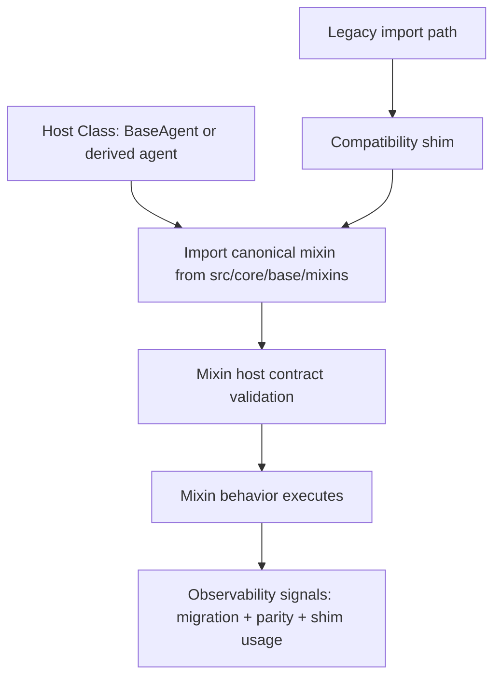

# idea000016-mixin-architecture-base - Design

_Status: DONE_
_Designer: @3design | Updated: 2026-03-30_

## Branch Plan
Expected branch: prj0000105-idea000016-mixin-architecture-base.

## Branch Validation
- PASS: Expected branch declared in project artifact.
- PASS: Observed branch matches expected (`git branch --show-current` -> `prj0000105-idea000016-mixin-architecture-base`).

## Scope Validation
- PASS: Design work constrained to project artifacts until @4plan handoff.
- PASS: Naming policy applied to all proposed new modules (`snake_case` file/module naming, `PascalCase` class names).
- PASS: Code of conduct policy reviewed and no exclusionary or harmful design constraints introduced.

## Failure Disposition
None.

## Selected Option
Option B - Incremental migration with compatibility shims.

Rationale:
1. Closes the architecture gap now by establishing `src/core/base/mixins/` as canonical base namespace.
2. Preserves runtime stability by keeping legacy import paths operational via explicit compatibility shims.
3. Supports controlled rollback and measurable migration progress with wave gates.

## Architecture
### Problem And Goals
This design establishes the missing base mixin architecture required by repository guidance while preventing breakage in existing imports and behavior.

Goals:
1. Define canonical base mixin namespace and contracts under `src/core/base/mixins/`.
2. Migrate selected mixins in staged waves using deterministic compatibility shims.
3. Keep `BaseAgent` orchestration-focused and avoid domain logic bloat.
4. Provide validation and rollback controls that are executable by @4plan/@6code/@7exec.

### Architecture Flow


### Component Responsibilities
1. `src/core/base/mixins/__init__.py`: Canonical export surface with deterministic `__all__`.
2. `src/core/base/mixins/host_contract.py`: Host protocol/ABC for required attributes and hooks.
3. `src/core/base/mixins/*_mixin.py`: Canonical mixin implementations migrated in waves.
4. Legacy mixin modules in `src/core/*`: Compatibility shims re-exporting canonical symbols.
5. `src/agents/BaseAgent.py`: Stays orchestration-centric; only adopts base mixins that pass contract and parity gates.

### Migration Waves
| Wave | Objective | Scope | Exit Gate |
|---|---|---|---|
| W0 | Scaffold canonical package | Create `src/core/base/mixins/` and host contract | Import smoke tests pass for canonical package |
| W1 | First canonical mixins | Migrate 1-2 low-risk mixins + shims | Old/new import parity tests pass |
| W2 | Security/critical mixins | Migrate audit/sandbox/replay candidates | Differential behavior tests + no circular imports |
| W3 | Host adoption | Adopt selected canonical mixins in target hosts | Runtime integration checks and observability baseline pass |
| W4 | Shim retirement | Remove expired shims | Expired-shim guard tests pass; no legacy path references |

### Shim Policy
1. Every legacy shim must re-export exactly one canonical symbol path.
2. Every shim must emit deprecation warning with removal milestone (`W4`).
3. Shims are allowed only during active migration waves W1-W3.
4. New code must import canonical paths only; legacy imports are blocked in lint/test guard.
5. Shim expiry is fail-closed: once expiry date/wave is reached, CI must fail on any remaining legacy import.

## Interfaces & Contracts
### Interface Catalog
| ID | Interface / Contract | Type | Description |
|---|---|---|---|
| IFACE-MX-001 | Base mixin package export contract | Module contract | Canonical exports in `src/core/base/mixins/__init__.py` are explicit and ordered |
| IFACE-MX-002 | Host contract protocol | Type contract | Required host attributes/hooks for base mixins (logger, config/state access, lifecycle hook points) |
| IFACE-MX-003 | Compatibility shim contract | Compatibility contract | Legacy module paths re-export canonical mixins with deprecation warnings |
| IFACE-MX-004 | Migration parity contract | Behavioral contract | Old vs new import path behavior must be equivalent for migrated mixins |
| IFACE-MX-005 | Shim expiry contract | Governance contract | Legacy path usage is rejected when shim removal gate triggers |
| IFACE-MX-006 | Observability contract | Operational contract | Migration emits metrics/events for shim usage, parity failures, and import failures |

### Proposed Public Shapes
```python
class BaseMixinHostProtocol(Protocol):
	# Minimal required host capabilities for migrated base mixins.
	logger: Any

	def get_runtime_context(self) -> dict[str, Any]: ...
	def emit_migration_event(self, event_name: str, payload: dict[str, Any]) -> None: ...
```

```python
class BaseBehaviorMixin:
	"""Base contract for canonical mixins under src/core/base/mixins/."""

	def validate_host_contract(self) -> None:
		...
```

```python
# Legacy shim pattern
from src.core.base.mixins.audit_mixin import AuditMixin  # canonical import
__all__ = ["AuditMixin"]
```

### Interface-To-Task Traceability For @4plan
| Interface ID | Planned Task IDs | Task Intent |
|---|---|---|
| IFACE-MX-001 | T01, T02 | Create canonical package structure and deterministic export surface |
| IFACE-MX-002 | T03, T04 | Define/implement host protocol and validation hook integration |
| IFACE-MX-003 | T05, T06 | Implement compatibility shims and deprecation signaling |
| IFACE-MX-004 | T07, T08 | Build parity test harness and differential checks |
| IFACE-MX-005 | T09 | Add shim-expiry enforcement checks |
| IFACE-MX-006 | T10 | Add migration observability events and guard metrics |

### Proposed @4plan Task Buckets
| Task ID | Summary | Target Files (initial estimate) |
|---|---|---|
| T01 | Create canonical mixin package skeleton | `src/core/base/mixins/__init__.py`, `src/core/base/mixins/host_contract.py` |
| T02 | Canonical export determinism guard | `tests/...` structure/export tests |
| T03 | Host protocol and validation helpers | `src/core/base/mixins/host_contract.py` |
| T04 | Integrate host contract checks in initial mixins | `src/core/base/mixins/*_mixin.py` |
| T05 | Add compatibility shim modules in legacy paths | `src/core/audit/...`, `src/core/sandbox/...`, `src/core/replay/...` |
| T06 | Deprecation warning policy in shims | legacy shim modules + tests |
| T07 | Differential parity tests (old/new path) | `tests/...` parity suite |
| T08 | Circular import smoke tests | `tests/...` import smoke suite |
| T09 | Shim expiry fail-closed checks | `tests/...` shim expiry checks |
| T10 | Migration observability and counters | observability module + tests |

## Non-Functional Requirements
### Performance
1. Mixin import indirection (legacy shim -> canonical) must not materially regress startup/import time for core agent modules.
2. Validation and parity checks run in CI, not on every runtime path, except lightweight host contract assertions.

### Security
1. Security-affecting mixins (audit/sandbox) require parity checks before migration wave exit.
2. Shim behavior must not bypass canonical validation hooks.
3. Migration observability must emit failed validation/import events for triage.

### Reliability
1. Old import paths remain functional until explicit shim expiry gate.
2. Circular import risks are tested in clean interpreter smoke checks.
3. Rollback path is available at each wave boundary.

### Testability
1. Every interface contract has at least one deterministic test selector.
2. Migration wave progression is blocked on defined gate evidence.

## Validation Strategy
1. Contract tests: canonical exports, host protocol conformance, shim contract conformance.
2. Differential tests: migrated mixin behavior old path vs canonical path.
3. Import graph checks: detect circular dependency regressions.
4. Governance checks: docs policy test gate and branch/scope constraints.
5. Operational validation: migration counters/events emitted under expected scenarios.

## Failure Modes And Rollback
| Failure Mode | Detection | Immediate Action | Rollback |
|---|---|---|---|
| Behavioral drift between legacy and canonical mixin | Differential parity test failure | Block wave promotion | Repoint shim to prior stable implementation and re-run parity |
| Circular import in shim chain | Import smoke test failure | Stop migration wave | Revert latest shim/module movement and rerun smoke tests |
| Missing host attributes in runtime | Host contract validation event/error | Disable adoption in host class | Keep host on legacy mixin path until contract updated |
| Shim overstay past expiry | Shim-expiry CI gate failure | Block merge | Either remove legacy usage or postpone expiry with explicit approval |
| Observability blind spot | Missing migration event assertions | Block wave signoff | Add/repair event emission before continuation |

## Open Questions Resolution
| Question | Disposition | Proposed Default |
|---|---|---|
| First-wave mixins to migrate | Resolved | Start with low-risk mixin(s), then audit/sandbox/replay in W2 |
| Canonical host contract detail | Resolved | Protocol-first minimal host contract (`logger`, `get_runtime_context`, `emit_migration_event`) |
| `BaseAgent` direct mixin adoption in first slice | Resolved | Default no direct broad adoption in W0/W1; allow controlled adoption in W3 only |
| Deprecation window for shims | Resolved | Time-box to waves W1-W3; removal at W4 gate |
| Required migration observability events | Resolved | `shim_used`, `parity_failed`, `import_error`, `host_contract_error` |
| ADR requirement for boundary+shim policy | Carried forward with default | Create ADR in this project and link it from design for @4plan consumption |

## Acceptance Criteria
| AC ID | Description | Verification Signal |
|---|---|---|
| AC-MX-001 | Canonical base mixin namespace exists and exports are deterministic | Export contract test passes |
| AC-MX-002 | Host contract is explicit and validated for migrated mixins | Host protocol tests + validation tests pass |
| AC-MX-003 | Legacy imports remain compatible during migration via explicit shims | Legacy import compatibility tests pass |
| AC-MX-004 | Migrated mixins preserve behavior parity old vs new path | Differential parity suite passes |
| AC-MX-005 | Circular import regressions are prevented | Import smoke suite passes on clean interpreter |
| AC-MX-006 | Shim expiry is enforced by CI gate | Expiry gate test fails on overdue legacy usage |
| AC-MX-007 | Migration observability events are emitted for key failure and usage paths | Event assertion tests pass |
| AC-MX-008 | Design artifact provides interface-to-task traceability for @4plan | Traceability table present and complete |
| AC-MX-009 | Docs workflow policy gate passes for updated project artifacts | `python -m pytest -q tests/docs/test_agent_workflow_policy_docs.py` passes |

## ADR
- Created ADR: `docs/architecture/adr/0003-base-mixin-canonical-namespace-and-shim-policy.md`
- Decision scope: canonical namespace boundary, compatibility shim policy, and staged migration governance.

## Policy Gate Results
| Gate | Command | Result |
|---|---|---|
| ADR governance | `python scripts/architecture_governance.py validate` | PASS (`VALIDATION_OK`, `adr_files=3`) |
| Docs workflow policy | `python -m pytest -q tests/docs/test_agent_workflow_policy_docs.py` | PASS (`12 passed`) |

## Handoff Readiness For @4plan
READY.